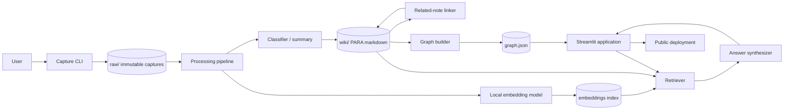

# SecondSelf — Your Personal AI Second Brain

## 1. Purpose and scope

SecondSelf is a local-first, end-to-end knowledge system that captures notes, links, and files; enriches each capture with AI-generated metadata; discovers semantic relationships; exposes the resulting knowledge graph; and answers natural-language questions using the user's own knowledge as the source of truth.

The system is designed around the four milestones in the project brief:

1. **The Archivist** — capture everything into a durable raw store.
2. **The Librarian** — classify, summarize, embed, and link captures.
3. **The Cartographer** — export and visualize the knowledge graph.
4. **The Oracle** — retrieve relevant knowledge, synthesize answers, and deploy one public application.

The first implementation should optimize for a small, understandable Python codebase and file-based persistence. A database can be introduced later without changing the pipeline contracts.

### Goals

- Capture a note, URL, or local file through one command.
- Preserve the original input exactly and make every capture traceable.
- Organize captures according to PARA: Projects, Areas, Resources, and Archives.
- Generate tags and a short summary with an LLM.
- Generate local embeddings and automatically create related-note links.
- Build a clean graph JSON document from the organized wiki.
- Render an interactive graph with hover, drag, and zoom behavior.
- Answer questions with retrieval-augmented generation using only retrieved user knowledge.
- Run locally and deploy the read/query experience to a public URL.

### Non-goals for the first release

- Multi-user collaboration and permissions.
- Editing a full note-management system in the browser.
- Training or fine-tuning a custom model.
- Guaranteed factual answers when the user's knowledge does not contain the answer.
- Replacing the original source files or silently mutating raw captures.

## 2. Architectural principles

1. **Raw data is immutable.** The original capture is never rewritten; later stages create derived artifacts.
2. **Every stage is rerunnable.** Classification, linking, graph generation, and indexing are deterministic where possible and idempotent by capture ID.
3. **Local-first processing.** Files and embeddings remain local by default. Only the minimum text required for LLM classification or answering is sent to a provider.
4. **Explicit provenance.** Every derived note records its source capture, model metadata, timestamps, and processing status.
5. **Human-readable storage.** Markdown and JSON are the primary formats so the system remains inspectable and portable.
6. **Provider isolation.** LLM and embedding providers are accessed through small interfaces so Groq, another compatible provider, or a local model can be substituted.
7. **Evidence before synthesis.** The answerer retrieves source notes first and the LLM may only synthesize from the supplied context.
8. **Graceful degradation.** The capture pipeline must work without an LLM; graph browsing must work without the answer service; and missing optional metadata must not destroy a note.

## 3. High-level architecture



### Logical components

| Component | Responsibility | Primary artifact |
|---|---|---|
| Capture CLI | Accept text, URLs, and files; assign IDs; preserve input | `raw/*.json` and copied attachments |
| Raw repository | Durable source of truth for captures | `raw/` |
| Classifier | PARA category, tags, summary, and optional title | metadata in wiki notes |
| Content extractor | Convert supported files and URLs into searchable text | normalized capture text |
| Embedding service | Create vectors for searchable content | `data/embeddings.*` |
| Linker | Compare vectors and add bidirectional related links | wiki front matter/body |
| Wiki repository | Store organized, human-readable notes | `wiki/<category>/*.md` |
| Graph builder | Convert notes and links into nodes and edges | `graph.json` |
| Retriever | Rank notes for a user question | in-memory result list |
| Answer service | Synthesize a cited answer from retrieved notes | answer plus sources |
| Streamlit UI | Graph exploration and ask-your-brain experience | `app.py` |
| Configuration | Provider, threshold, paths, and limits | environment variables / `.env` |

## 4. Repository and storage layout

```text
secondself/
├── raw/                         # Immutable capture records
│   ├── 2026/08/                 # Optional date partitioning
│   │   └── <capture-id>.json
│   └── attachments/             # Copied files referenced by captures
├── wiki/                        # Derived, organized Markdown notes
│   ├── projects/
│   ├── areas/
│   ├── resources/
│   └── archives/
├── data/                        # Rebuildable machine-readable indexes
│   ├── embeddings.json          # Initial portable implementation
│   ├── embeddings.npy           # Optional efficient vector storage
│   └── processing-state.json
├── static/
│   └── graph.html               # Optional graph template/assets
├── docs/
│   ├── problem-statement.md
│   ├── architecture.md         # This document may be copied here if docs is preferred
│   ├── implementation-plan.md
│   └── edge-cases.md
├── capture.py
├── classify.py
├── link.py
├── build_graph.py
├── ask.py
├── app.py
├── requirements.txt
├── .env.example
├── .gitignore
└── README.md
```

The initial implementation may keep `architecture.md` at the repository root because that is the location requested in the brief. If all project documentation is later standardized under `docs/`, move it there and update references; code should not depend on the documentation location.

### 4.1 Raw capture record

Each capture is stored as one JSON document. A suggested schema is:

```json
{
  "id": "cap_20260801T143022Z_a1b2c3d4",
  "captured_at": "2026-08-01T14:30:22Z",
  "type": "note",
  "title": "Idea for a retrieval workflow",
  "content": "The original note text...",
  "source": null,
  "attachment_path": null,
  "content_sha256": "...",
  "schema_version": 1
}
```

`type` is one of `note`, `link`, or `file`. For a URL, `source` contains the URL and `content` contains the URL or extracted page text when extraction is enabled. For a file, `attachment_path` points to a copied file inside `raw/attachments/`; the original filename and MIME type should also be retained. The hash makes duplicate detection possible without discarding the original capture.

### 4.2 Wiki note format

Every processed capture becomes one Markdown file with YAML front matter:

```yaml
---
id: cap_20260801T143022Z_a1b2c3d4
source_capture: ../raw/2026/08/cap_20260801T143022Z_a1b2c3d4.json
category: resources
tags:
  - retrieval
  - ai
summary: A short, model-generated description of the note.
created_at: 2026-08-01T14:30:22Z
processed_at: 2026-08-01T14:32:10Z
embedding_model: sentence-transformers/all-MiniLM-L6-v2
---

# Idea for a retrieval workflow

The original or normalized capture content appears here.

## Related notes

- [[another-note]] — similarity: 0.81
```

The Markdown body remains readable without the application. Links use a stable wiki-note slug or capture ID, never a fragile absolute path.

## 5. End-to-end data flow

### 5.1 Capture flow

1. The user invokes `capture.py` with one of `--text`, `--url`, or `--file`.
2. The CLI validates that exactly one input mode is selected.
3. It reads or copies the input without overwriting any existing file.
4. It generates a UTC timestamp and collision-resistant ID.
5. It computes a content hash and writes the raw JSON record atomically using a temporary file followed by rename.
6. It reports the capture ID and path.
7. Optional processing can be invoked afterward, but capture must not depend on network availability.

### 5.2 Classification flow

1. Discover raw records that have no successful classification or whose processing version is stale.
2. Extract normalized text, applying size limits and redaction rules.
3. Send a strict JSON prompt to the configured LLM provider.
4. Validate the response against a schema:
   - `category`: exactly one PARA value;
   - `tags`: bounded list of short strings;
   - `summary`: one concise sentence;
   - optional `title`.
5. Retry transient provider failures with bounded exponential backoff.
6. On invalid or unavailable LLM output, use a safe fallback category (`resources`), a filename/title-derived summary, and an empty tag list while marking the record as degraded.
7. Write or update the wiki note idempotently.

The classifier must treat captured text as untrusted content. Prompt instructions must be separated from the content, and the model output must never be executed.

### 5.3 Embedding and linking flow

1. Load the searchable text of all wiki notes.
2. Compute embeddings with a local `sentence-transformers` model.
3. Normalize vectors and persist them alongside note IDs and the embedding-model version.
4. For each new or changed note, calculate cosine similarity against existing notes.
5. Ignore self-matches and links below the configurable threshold.
6. Keep at most `MAX_RELATED_NOTES` links per note, selecting the highest scores.
7. Write links bidirectionally and avoid duplicate links.
8. Preserve manually authored links; mark generated links so they can be rebuilt without deleting manual relationships.

For an initial local implementation, a NumPy matrix with cosine similarity is sufficient. When the collection becomes large, replace this adapter with FAISS or another vector index while retaining the same retrieval interface.

### 5.4 Graph flow

1. Scan every Markdown note under `wiki/`.
2. Parse front matter and note content.
3. Create one node per note with stable ID, title, category, summary, tags, and a truncated content preview.
4. Parse `[[slug]]` references and generated related-note metadata.
5. Create one deduplicated edge per relationship, including edge type and similarity where available.
6. Remove edges whose target cannot be resolved, while recording warnings for diagnosis.
7. Write `graph.json` atomically with a schema version and generation timestamp.

Suggested graph shape:

```json
{
  "schema_version": 1,
  "generated_at": "2026-08-01T15:00:00Z",
  "nodes": [
    {
      "id": "cap_...",
      "label": "Idea for a retrieval workflow",
      "category": "resources",
      "tags": ["retrieval", "ai"],
      "summary": "...",
      "content_preview": "..."
    }
  ],
  "edges": [
    {
      "source": "cap_...",
      "target": "cap_...",
      "type": "semantic",
      "weight": 0.81
    }
  ]
}
```

### 5.5 Question-answering flow

1. The user submits a question in the Streamlit interface.
2. The retriever embeds the question using the same embedding model as the wiki.
3. It ranks notes by cosine similarity and applies a minimum score and top-$k$ limit.
4. Optional lexical matching can be combined with vector scores to improve exact-name and date queries.
5. The answer prompt includes only the selected notes, each labeled with its stable source ID and title.
6. The LLM is instructed to answer from those sources, distinguish facts from uncertainty, and state when the notes do not contain enough information.
7. The response is returned with source-note links and similarity scores.
8. The UI displays the answer, evidence, and a clear no-results state.

The answer service must not claim that it searched the entire world or invent details absent from the supplied context.

## 6. Module contracts

### `capture.py`

- `capture_note(text: str, title: str | None = None) -> CaptureRecord`
- `capture_url(url: str, title: str | None = None) -> CaptureRecord`
- `capture_file(path: Path) -> CaptureRecord`
- CLI entry point for one-command capture.

### `classify.py`

- `classify_capture(record: CaptureRecord) -> Classification`
- `process_pending_captures() -> ProcessingReport`
- `LLMClient.classify(text: str) -> Classification`

### `link.py`

- `embed_notes(notes: list[WikiNote]) -> EmbeddingIndex`
- `find_related(note_id: str, index: EmbeddingIndex) -> list[RelatedNote]`
- `update_related_links(note: WikiNote, related: list[RelatedNote]) -> None`

### `build_graph.py`

- `build_graph(wiki_dir: Path) -> GraphDocument`
- `write_graph(graph: GraphDocument, output_path: Path) -> None`

### `ask.py`

- `retrieve(question: str, top_k: int = 5) -> list[RetrievedNote]`
- `ask(question: str, top_k: int = 5) -> Answer`

The application should import these functions rather than duplicate pipeline logic. CLI scripts should remain thin adapters over the module contracts.

## 7. AI and provider architecture

### Classification and answer LLM

Use a provider adapter with a default Groq-compatible implementation. The API key is read only from an environment variable such as `GROQ_API_KEY`; it is never committed or placed in graph data. The adapter should support:

- model name configuration;
- request timeout;
- bounded retries for rate limits and transient failures;
- structured JSON output for classification;
- token and input-size limits;
- provider error metrics in logs without logging secrets or full private content.

### Embeddings

Use `sentence-transformers/all-MiniLM-L6-v2` or another small local sentence-transformer as the default. Store the model name and vector dimension in the index. If the model changes, invalidate and rebuild the embedding index instead of comparing vectors from different spaces.

### Prompt boundaries

- System instructions define the expected task and output schema.
- Captured content is placed in a clearly delimited user-content section.
- Retrieved notes are labeled as evidence, not instructions.
- The model must ignore instructions found inside notes that attempt to change the task.

## 8. Streamlit application architecture

The app has two primary views in one application:

### Brain graph

- Load `graph.json` once per session or when its modification time changes.
- Render a force-directed graph using a browser-compatible library, preferably Cytoscape.js or vis-network embedded through a controlled HTML component.
- Color nodes by PARA category.
- Show title, summary, tags, and content preview on hover.
- Support drag, pan, zoom, category filtering, and node selection.
- Gracefully display an empty-state message when no graph has been generated.

### Ask your brain

- A text input and submit button.
- Configurable retrieval depth, defaulting to five notes.
- Answer panel with source notes and confidence/relevance indicators.
- Clear error states for missing API keys, model failures, malformed indexes, and no relevant notes.
- Do not expose raw provider credentials or internal stack traces to users.

The public deployment should default to read-only/query behavior. Capture and reprocessing commands should remain local or be protected because an unauthenticated public app must not allow arbitrary filesystem writes.

## 9. Configuration

Use environment variables with safe defaults:

```text
SECONDSELF_RAW_DIR=raw
SECONDSELF_WIKI_DIR=wiki
SECONDSELF_DATA_DIR=data
SECONDSELF_GRAPH_PATH=graph.json
SECONDSELF_LLM_PROVIDER=groq
SECONDSELF_LLM_MODEL=<configured-model>
GROQ_API_KEY=<secret>
SECONDSELF_EMBEDDING_MODEL=sentence-transformers/all-MiniLM-L6-v2
SECONDSELF_SIMILARITY_THRESHOLD=0.65
SECONDSELF_TOP_K=5
SECONDSELF_MAX_RELATED_NOTES=5
SECONDSELF_MAX_CONTENT_CHARS=12000
```

A `.env.example` documents names but contains no real credentials. Configuration is loaded once and validated at startup; paths are resolved relative to the project root unless explicitly configured.

## 10. Reliability, consistency, and recovery

- Use atomic writes for raw records, wiki notes, indexes, and graph JSON.
- Never overwrite a raw record with a retry result.
- Make processing keyed by capture ID plus pipeline version.
- Keep a processing state file containing status, last error, model version, and timestamps.
- Continue processing other captures when one capture fails.
- Emit structured logs with capture ID and stage.
- Provide rebuild commands for wiki metadata, embeddings, links, and graph artifacts.
- Validate all generated JSON and front matter before replacing existing artifacts.
- Back up or commit `raw/` and `wiki/`; treat `data/`, `graph.json`, and generated links as rebuildable.

## 11. Privacy and security

- Keep `.env` and API keys out of version control.
- Do not send local file bytes to the LLM unless extraction is explicitly enabled.
- Truncate content before external requests and document the behavior.
- Add optional redaction for obvious secrets such as API keys, passwords, and private tokens.
- Escape or sanitize Markdown and graph hover content before rendering HTML.
- Resolve file paths safely and reject paths that escape the configured raw directory.
- Validate URLs and use request timeouts if URL fetching is implemented.
- Treat all captured text and retrieved notes as untrusted prompt data.
- Public deployment must not expose filesystem paths, environment values, debug traces, or write-capable endpoints.

## 12. Testing strategy

### Unit tests

- ID and timestamp generation.
- Note, URL, and file capture validation.
- Duplicate hashing and atomic writes.
- PARA response validation and fallback classification.
- Markdown front matter parsing and safe slug generation.
- Cosine similarity, thresholding, top-$k$, and self-match exclusion.
- Bidirectional link deduplication.
- Graph node/edge generation, unresolved-link handling, and JSON schema.
- Retrieval ranking and answer prompt construction.

### Integration tests

- Capture one item of each supported type and process it end to end.
- Process repeated runs without duplicate wiki files or edges.
- Simulate unavailable LLM and embedding services.
- Rebuild graph from wiki after deleting generated data.
- Query with no relevant notes and verify an honest no-evidence response.

### Acceptance tests using real data

- Week 1: at least 10 real captures across notes, links, and files.
- Week 2: at least 15 real captures classified into PARA folders with summaries, tags, embeddings, and links.
- Week 3: graph generated from real wiki data; hover, drag, and zoom verified.
- Week 4: real questions answered with visible source notes; the complete app runs from a clean setup.

## 13. Deployment architecture

The recommended deployment target is Streamlit Community Cloud or Hugging Face Spaces:

1. Push source, `wiki/`, sanitized `graph.json`, and rebuildable metadata to a public GitHub repository.
2. Store `GROQ_API_KEY` as a deployment secret, never in the repository.
3. Install pinned dependencies from `requirements.txt`.
4. Run the preprocessing pipeline before deployment so the app can render the graph immediately.
5. Configure the app entry point as `app.py`.
6. Verify that the public app can load graph data and answer questions without write access.
7. Keep sensitive private notes out of a public repository; use a private deployment or a sanitized knowledge set if the knowledge base is personal.

The deployment pipeline should fail fast when required generated artifacts are missing, but the UI should explain how to generate them rather than presenting a stack trace.

## 14. Observability and operational limits

Track, at minimum:

- number of raw captures and processed wiki notes;
- classification success, fallback, and failure counts;
- embedding model and index size;
- graph node and edge counts;
- retrieval latency and number of sources;
- LLM request failures and rate-limit responses.

Apply limits to prevent accidental cost or memory growth: maximum input characters, maximum retrieved notes, maximum answer tokens, request timeout, and bounded retry count.

## 15. Key architectural decisions

| Decision | Choice | Reason |
|---|---|---|
| Primary persistence | JSON + Markdown files | Transparent, portable, easy to inspect and version |
| Classification | Provider-backed LLM with strict schema | Meets automatic PARA classification while keeping provider replaceable |
| Embeddings | Local sentence-transformers | Free for normal use and keeps semantic indexing private |
| Initial vector search | NumPy cosine similarity | Minimal dependency and adequate for a personal corpus |
| Graph format | Versioned `graph.json` | Separates graph generation from UI and supports multiple renderers |
| UI | Streamlit | Fast path to one deployable Python application |
| Public app behavior | Read/query first | Prevents unauthenticated users from writing to the knowledge base |
| Source of truth | Immutable raw captures | Prevents accidental loss and supports reprocessing |

## 16. Definition of done

The architecture is implemented when:

- a clean checkout can create `raw/`, `wiki/`, and `data/` and run the capture command;
- a note, URL, and file each produce traceable raw records with IDs and UTC timestamps;
- at least 15 real captures can be classified and organized into PARA folders;
- embeddings and generated related links are persisted and reproducible;
- `graph.json` contains valid nodes and edges from the wiki;
- the Streamlit app renders the real graph with hover, drag, and zoom;
- `ask()` retrieves relevant notes and returns an answer with evidence or an honest no-evidence result;
- the application runs from documented setup instructions and can be deployed without exposing secrets;
- the full flow — capture → classify → link → graph → ask — has been verified locally and, where applicable, at the public URL.
